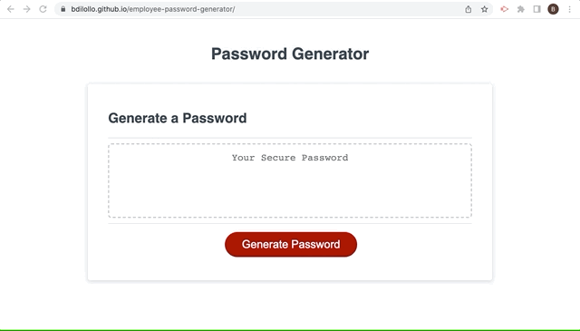

# employee-password-generator

[Click here for deployed application](https://bdilollo.github.io/employee-password-generator/)

## Description
This project serves as my first attempt at building an application using JavaScript. Functionally, it is a 'password generator'--it produces random strings of characters based on given criteria. It is interactive, requiring the user to click a button before launching, and adaptable, altering its content according to user selections.

---

## Screenshot

---

## Contact
[LinkedIn](https://www.linkedin.com/in/bradley-dilollo/)  
[GitHub](https://github.com/bdilollo)

## License
[MIT](/LICENSE.txt) &#124; 2022 &#124; Bradley DiLollo